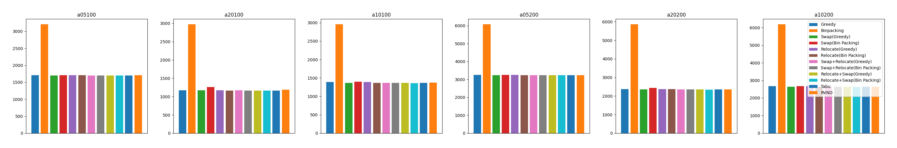
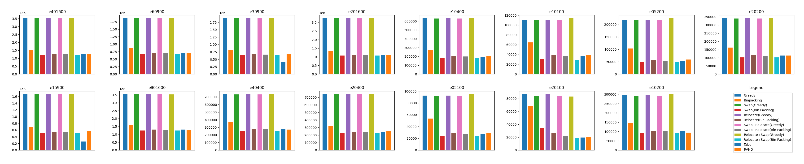
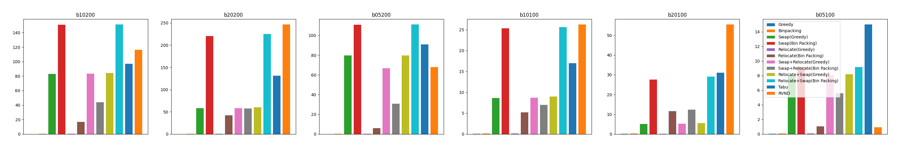
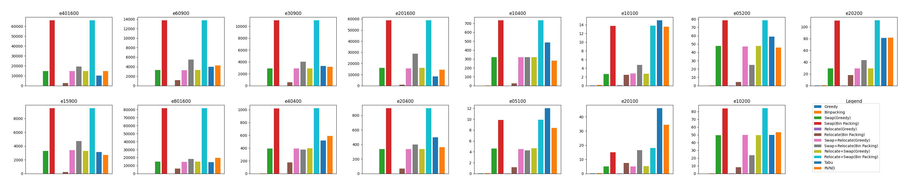
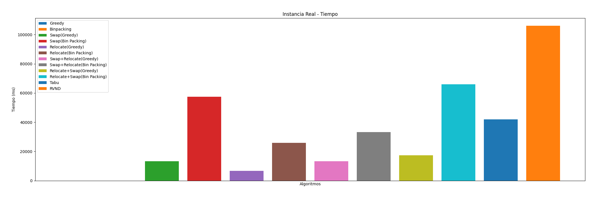

\newpage

# Introducción

La empresa $\text{ThunderPack}$ es una $\text{start-up}$ que ofrece servicios logísticos y gestiona una red de comercios que actúan como puntos de consolidación para la recolección de paquetes. Sin embargo, la actual modalidad de operación permite a los vendedores elegir libremente a qué depósito llevar sus paquetes, lo que genera una utilización ineficiente de la capacidad de almacenamiento, reclamos y costos adicionales. Para garantizar una buena experiencia a los vendedores, especialmente en eventos de alta demanda, $\textbf{ThunderPack}$ está considerando migrar a una modalidad centralizada donde a cada vendedor se le asignará un depósito regularmente, buscando cumplir con las capacidades máximas de cada depósito y minimizar la distancia total recorrida por los vendedores.

## Problema

El problema descripto anteriormente puede ser modelado mediante el $\textbf{Problema de Asignación Generlizada}$ (GAP, $\text{Generalized Assignment Problem}$) que, en su versión más general, puede ser formulado de la siguiente forma. Sea $N = {1,...,n}$ el conjunto de vendedores y $M = {1,...,m}$ el conjunto de depósitos. Cada depósito $i \in M$ tiene una capacidad máxima de recepción $c_i$, medida en cantidad de unidades. Dado un vendedor $j \in N$ y un depósito $i \in M$, $d_{ij}$ denota la demanda (también en cantidad de unidades) a utilizar y $c_{ij}$ el costo incurrido si $j$ es asignado a $i$. Con estas definiciones, podemos representar una solución como una colección de conjuntos $\Gamma_1$, $\dots$, $\Gamma_m \subseteq N$, con $\Gamma_i$ el subconjunto de venededores asignados al depósito $i \in M$. Luego, el GAP consiste en:

1.  Cada vendedor debe ser asignado a un depósito, es decir, para
    $j \in N$

2.  La capacidad de cada depósito no debe ser excedida, es decir, para
    $i \in M$

$$
  \displaystyle\sum_{j\in{\Gamma_1}}^{} d_{ij} \leq c_i
$$

3. Minimizar costo total de la asignacion dada por:

$$
  \displaystyle\sum_{i=1}^{n} \displaystyle\sum_{j\in{\Gamma_1}}^{} c_{ij}
$$

En el contexto del problema de ThunderPack, tomaremos $c_{ij}$ como la distancia que debe recorrer el vendedor j en caso de ser asignado al depósito i. Notar que, dependiendo de las capacidades y las demandas, podría dificultarse encontrar una solución factible que asigne a todos los vendedores y respete las capacidades. Definimos: $$ c_{max} = \max_{i \in M, j \in N} c_{ij} $$

como la máxima distancia posible a recorrer por un vendedor. En caso de tener una solución parcial, donde haya vendedores que no pueden ser asignados a algún depósito, se asumirá una penalización de $3 \times d_max$ por cada uno de ellos.

Para cada vendedor, nuestra estimación de la demanda (en cantidad de unidades) es la misma independientemente del depósito al que sea asignado, y por lo tanto $d_{ij} = d_j$. De todas formas, trabajaremos con la versión general del GAP y, al momento de abordar las instancias con datos reales, serán un caso particular para el algoritmo.

\newpage

# Descripción de modelos propuestos

## Heurísticas constructivas

### Heurística constructiva golosa (Greedy MinCost)

La primera heurística que se implementó es una heurística constructiva golosa. La misma consiste en asignar a cada vendedor al depósito más cercano (el que sume el menor costo al total) que tenga capacidad disponible. En caso de que no haya capacidad disponible en ningún depósito, los vendedores no se asignan y se asume la penalizacion de $3 \times d_max$ por cada uno de ellos.

La estrategia golosa sigue los siguientes pasos:

1.  Seleccionar un orden arbitrario para recorrer los vendedores. El implementado es el orden dado por los archivos.
2.  Asignar al primer vendedor el depósito de menor costo.
3.  Para cada vendedor subsiguiente, asignar al depósito de menor costo que tenga capacidad disponible.
4.  Repetir el paso 3 hasta asignar todos los vendedores posibles.
5.  Finalmente se obtiene una solución factible.

Esta estrategia golosa busca minimizar los costos de asignación al seleccionar los depósitos de menor costo en cada etapa. Sin embargo, es importante tener en cuenta que esta estrategia no garantiza encontrar la solución óptima global ni una local para el problema.

### Heurística constructiva BinPacking

La estrategia de Bin Packing optimiza el uso de los depósitos en el contexto del problema de asignación. En este caso, el objetivo es maximizar la utilización de la capacidad de cada depósito asignando a los vendedores de manera eficiente.

La estrategia sigue los siguientes pasos:

1.  Seleccionar un orden arbitrario para recorrer los vendedores. Al igual que en la golosa se dicta por el orden de los vendedores en los archivos.
2.  Para cada vendedor, evaluar en qué depósito se dejaría menos espacio libre si se asigna su carga.
3.  Asignar al vendedor al depósito que tenga la menor cantidad de espacio libre después de agregar su carga.
4.  Actualizar la capacidad del depósito asignado después de cada asignación.
5.  Repetir los pasos 2, 3 y 4 hasta asignar todos los vendedores. En esta estrategia, el enfoque principal es minimizar el espacio libre en los depósitos asignando a los vendedores de manera eficiente. No se tienen en cuenta los costos de asignación, sino únicamente la capacidad restante en cada depósito.

Esta estrategia tampoco garantiza encontrar la solución óptima global para el problema, pero se centra en utilizar de manera eficiente el espacio en los depósitos. De esta forma, reducimos la cantidad de vendedores que quedan sin asignar y reducimos las penalizaciones.

\newpage

## Operadores de búsqueda local

### Swap

El operador de búsqueda local Swap genera un vecindario de solucione $S\prime$ a partir de una solución factible $S$, del cual se obtiene la mejo solución $S\prime$ cuyo costo sea mejor que $S$. Esto se repite hasta que n haya mejora posible. Los pasos a seguir son los siguientes:

1.  Dada una solución factible $S$. Se seleccionan todos los pares de vendedores $v$, $w$ con $v \neq w$ y $v$, $w \in N$.

-   A partir de cada par $v$, $w$, se determinan los depósitos $dv$ y $dw$ asignados a $v$ y $w$ respectivamente. Si $v$ o $w$ no estan asignados, $dv = -1$ o $dw = -1$. Si ambos no se encuentran asignados se corta la exploración para este vecino.
-   Se determina si la capacidad del deposito dv al quitar la demanda de $v$ permite alojar la demanda de $w$ para $dv$, y viceversa.
-   En este caso, se desasigna $dv$ de $v$ y $dw$ de $w$, para luego hacer un enroque y asignar $dv$ a $w$ y $dw$ a $v$.
-   Se almacena la factibilidad del Swap, junto a los vendedores y deposito involucrados, y el costo de una posible nueva solución $S\prime$ producto de efectuar el Swap sobre $S$. Esto se hizo por sobre copiar la solución, efecutarle el swap y guardarla para reducir la complejidad algoritmica y espacial.

2.  Dadas todas las posibles nuevas soluciones, se selecciona aquella que resulte en el menor costo.

-   Si dicho costo es menor que el de la solución S actual, se efectúa el Swap que produjo mejor costo sobre la solución actual y se repite el paso 1.
-   Si dicho costo es mayor o igual, se detiene la exploración de vecindarios.

De está forma obtenemos una heurística de búsqueda local que explora vecindarios de forma exhaustiva hasta que no exista una mejora sobre el vecindario de mi solución, por lo que encontré un mínimo local.

### Relocate

Al igual que el operador de búsqueda local Swap, el operador Relocate genera un vecindario de soluciones $S\prime$ a partir de una solución factible $S$, del cual se obtiene la mejor solución $S\prime$ cuyo costo sea mejor que $S$. Esto se repite hasta que no haya mejora posible. Los pasos a seguir son los siguientes:

1.  Dada una solución factible $S$ se seleccionan todos los vendedores.

-   Para cada vendedor, se evalúa si el costo de reasignar dicho vendedor a otro deposito del que esté asignado es menor, cuya capacidad tambien permita la demanda del vendedor. En el caso del vendedor no estar asignado, siempre el costo será al ser asignado que al no estarlo ya que: Si $x \in c = \{x_1, x_2, \dots, x_n\}$ con $x_1, x_2, \dots, x_n\ \in \mathbb{R} \implies x \leq 3 \times \text{max}\{c\}$

-   Se almacena la factibilidad y, si el costo es menor, tambien el vendedor, su nuevo deposito a ser asignado y su costo resultante.

2.  Para cada reubicación posible, se obtiene aquella de menor costo resultante.

-   Si dicho costo es menor que el de la solución S actual, se efectúa el Swap que produjo mejor costo sobre la solución actual y se repite el paso 1.
-   Si dicho costo es mayor o igual, se detiene la exploración de vecindarios.

\newpage

## Otras heurísticas

Para el desarrollo de la metaheurística que se va a detallar mas se adelante se implementaron dos heurísticas que se utilizaron para la generación de soluciones iniciales y para la destrucción de soluciones en la búsqueda local. Estas son:

### Random Greedy

A partir de un orden aleatorio de los vendedores, se llevan a cabo lospasos 2-5 de la estrategia golosa.

### Random BinPacking

A partir de un orden aleatorio de los vendedores, se llevan a cabo los pasos 2-5 de la estrategia BinPacking.

### Random Destroyer

Dada una solución factible, se destruye la solución de manera aleatoria. Primero, se genera un número aleatorio de veces que se realizará la "destrucción" que consiste en lo siguiente:

1.  Se genera un nuevo número aleatorio que representa un cliente en el rango de clientes disponibles.

2.  Se genera otro número aleatorio que representa un depósito en el rango de depósitos disponibles, incluyendo la opción de no asignar el cliente a ningún depósito (-1 representa esta opción).

3.  Se obtiene el depósito previamente asignado al cliente.

4.  Si el número generado para el depósito es -1, significa que el cliente no se asignará a ningún depósito en esta iteración y se continúa con la siguiente iteración del bucle. Existió la idea de desasignar vendedores cómo parte de la destrucción, sin embargo nos resultó muy contraproducente a la hora de explorar nuevos vecindarios.

5.  Si el cliente no estaba previamente asignado al depósito generado:

6.  Se verifica si el depósito tiene capacidad para atender la demanda del cliente.

-   Si es así, se verifica si el cliente estaba asignado a otro depósito. En caso afirmativo, se desasigna el cliente de ese depósito.
-   Luego, se asigna el cliente al depósito generado.

Finalmente se habrá obtenido una nueva solución factible, que se espera
se encuentre en un nuevo vecindario.

\newpage

## Metaheurística

### Busqeda Tabú sobre soluciones Golosas y Bin Packing, aleatorias y destruidas

A modo de "escapar" de los mínimos locales a los que se llega con la búsqueda local, se implementó una metaheurística que consiste en losiguiente:

1.  Se inicializan las variables, `iter_count` (número máximo de iteraciones), `max_tries` (número máximo de reinicios), `cutoff` (límite despues de `cutoff` soluciones peores), y `neighbourhood_count` (número de vecinos a explorar en cada iteración). Y un vector llamado `solutions` para almacenar los minimos locales encontrados durante el proceso.

Para cada iteración del algoritmo:

2.  Se genera una solución inicial utilizando la heurística Random Greedy.

3.  Con probabilidad de 0.5 sobre una distribución uniforme, se destruye la solución utilizando la heurística Random Destroyer.

4.  Se lleva a cabo un Relocate exhaustivo a modo _Best Improvement_ sobre la solución obtenida en el paso anterior.

Dada la cantidad de vecindarios a descender:

5.  Se lleva a cabo una exploración del vecindario a partir del operador Swap. A diferencia de como lo resuelve el algoritmo de búsqueda local, si el costo de la menor solucion del vecindario esta dentro de un margen de error del costo de la solución actual, se repite el paso 6.

6.  Luego de haber explorado el vecindario dicha cantidad de veces, se asigna la mejor solución encontrada a la solución actual.

7.  Se asigna la solución actual a la lista de soluciones encontradas.

8.  Si las últimas `cutoff` iteraciones no hubo mejora, se reinicia la solución actual, alternando entre reinicios entre una solución Random Greedy y una Random BinPacking.

9. Si se supera el número máximo de iteraciones, se detiene el algoritmo.

\newpage

# Experimentación

## Descripción de las Instancias

Para la experimentación se contó con 27 instancias de prueba divididas en 3 grupos "A", "B" y "E" asi como una instancia real. Compuestas de la siguiente manera:

- La instancia real cuenta con 1100 vendedores y 310 depósitos.

- Las instancias "A", "B" y "E"

| Depositos a   | Vendedores a   | Depositos b   | Vendedores b   |   Depositos e |   Vendedores e |
|:--------------|:---------------|---------------|----------------|--------------:|---------------:|
| 5.0           | 100.0          | 10.0          | 200.0          |            40 |           1600 |
| 20.0          | 100.0          | 20.0          | 200.0          |            15 |            900 |
| 10.0          | 100.0          | 5.0           | 200.0          |            60 |            900 |
| 5.0           | 200.0          | 10.0          | 100.0          |            80 |           1600 |
| 20.0          | 200.0          | 20.0          | 100.0          |            30 |            900 |
| 10.0          | 200.0          | 5.0           | 100.0          |            40 |            400 |
|               |                |               |                |            20 |           1600 |
|               |                |               |                |            20 |            400 |
|               |                |               |                |            10 |            400 |
|               |                |               |                |             5 |            100 |
|               |                |               |                |            10 |            100 |
|               |                |               |                |            20 |            100 |
|               |                |               |                |             5 |            200 |
|               |                |               |                |            10 |            200 |
|               |                |               |                |            20 |            200 |

## Metodología

Sobre cada instancia se corrieron los siguientes algoritmos:

- Heurística Greedy
- Heurística Bin Packing
- Swap sobre Greedy
- Swap sobre Bin Packing
- Relocate sobre Greedy
- Relocate sobre Bin Packing
- Metaheurística

Ademas para comparar contra la metaheurística se corrieron las siguientes combinaciones de operadores de busqueda local "encadenados":
       
- Swap + Relocate sobre Greedy
- Swap + Relocate sobre Bin Packing
- Relocate + Swap sobre Greedy
- Relocate + Swap sobre Bin Packing

Sobre cada ejecución de cada algoritmo se midió el tiempo de ejecución, el costo de la solución obtenida y la cantidad de vendedores sin asignar.

La ejecución se realizó sobre una computadora con las siguientes características:

- Modelo: Macbook Pro 2020 13"
- Procesador: Apple Sillicon M1 (ARM)
- Memoria: 16GB
- Sistema Operativo: macOS 13.3.1 (a) (22E772610a)

\newpage

## Resultados sobre instancias "A", "B" y "E"

### Costos de las soluciones

A diferencia del resto de las instancias, para la instancia A, la solución obtenida de forma Greedy para el orden del archivo parece ser la mejor o casi la mejor solución. En comparación con el algoritmo de Bin Packing los resultados son menores de la mitad, y al aplicarle una busqueda local la mejora es prácticamente mínima. Sin embargo al aplicarle una cadena de operadores de búsqueda local a la solución BinPacking (Relocate(Swap(BinPacking)) es cuando se logra obtener un minimo local mejor que el obtenido por la heurística Greedy. En la siguiente tabla se pueden ver algunos resultados.

| D     |V        | G        | BP          | S(G)        | S(BP)         | R(G)         |R(BP)           |   S(R(G))      |   S(R(BP))   |   R(S(G))    |    R(S(BP))  |   M   |
|-------|---------|----------|-------------|-------------|---------------|--------------|----------------|----------------|--------------|--------------|--------------|-------|
|     5 |     100 |     1709 |        3206 |        1700 |          1712 |         1709 |           1719 |           1700 |         1699 |         1700 |         1698 |  1700 |
|    20 |     100 |     1170 |        2972 |        1168 |          1245 |         1170 |           1165 |           1168 |         1163 |         1167 |         1161 |  1167 |
|    10 |     100 |     1390 |        2954 |        1367 |          1395 |         1390 |           1369 |           1367 |         1369 |         1365 |         1363 |  1365 |
<!--
|     5 |     200 |     3259 |        6075 |        3238 |          3258 |         3259 |           3236 |           3238 |         3235 |         3238 |         3235 |  3238 |
|    20 |     200 |     2371 |        5855 |        2353 |          2423 |         2371 |           2357 |           2353 |         2354 |         2353 |         2345 |  2353 |
|    10 |     200 |     2670 |        6183 |        2632 |          2677 |         2670 |           2636 |           2632 |         2633 |         2628 |         2629 |  2632 |
-->

||
|:--:|
|Costos sobre Instancia A|

Para las instancias B y E los resultados son diferentes, aquellas soluciones que parten de la generada por la heuristica Bin Packing son las mejores en la mayoría de los casos, y en los casos en los que no lo son, al aplicar operadores de búsqueda local sobre la solución de Bin Packing se logran obtener mejores resultados que al aplicarlos sobre la solución de Greedy.

||
|:--:|
|Costos sobre Instancia B|

||
|:--:|
|Costos sobre Instancia E|

\newpage
En cuanto a la Metaheurística propuesta, a lo largo de todas las instancias en la mayoría de los casos se logra obtener una solución mejor que la obtenida por los otros algoritmos. El único resultado similar y hasta a veces mejor se obtiene a partir de encadenar el operador Relocate sobre la solución ya minimizada por el operador Swap en una solución Bin Packing (Relocate(Swap(BinPacking)). Esto es sin embargo a cuestas de un tiempo de ejecución.

### Tiempo de ejecución

Como era de esperarse, los tiempos de ejecución de las heuristicas constructivas son ordenes de maginitud menores que los de los operadores de búsqueda local. En el caso de la metaheurística, el tiempo de ejecución es mayor que el de las heuristicas constructivas pero menor que el de los operadores de búsqueda local pero con la ventaja de obtener una solución mejor. Salvo por el Relocate(Swap(BinPacking), aquel cuyos resultados son similares a los de la metaheurística, en los que en varios casos la metaheurística logra obtener una solución mejor en un tiempo de ejecución menor. Esto es en parte por los hyperparametros elegidos de forma arbitraria de la metaheurística.

||
|:--:|
|Tiempo sobre Instancia A|

||
|:--:|
|Tiempo sobre Instancia B|

||
|:--:|
|Tiempo sobre Instancia E|

\newpage

### Vendedores sin asignar

Para las instancias "A", tanto la solución Greedy como la de BinPacking logran asignar a todos los vendedores, por lo que no hay vendedores sin asignar. Consecuentemente, los operadores locales no logran mejorar la solución ya que no hay vendedores sin asignar a los cuales reasignar. Ademas por su naturaleza, nunca descubrirían un vecindario mejor cuya cantidad de vendedores sin asignar sea mayor que cero porque su costo sería peor.

<!--
||
|:--:|
|Instancia A|
-->

Por el otro lado, en las instancias "B" y "E", la solución BinPacking logra asignar a todos los vendedores, mientras que la solución Greedy no. Es facil de ver en las figuras "Libres sobre Instancia B" y "Libres sobre Instancia E" por su carácter de "peine". No solo esto, si no que a traves de todas las instancias, la única mejora en este aspecto la presenta la cadena Relocate+Swap sobre la solución Greedy, y no es garantía. La intuición detras de esto la hayamos al pensar que la solución Greedy "bloquea" los depositos de forma tal que cuesta lograr reducir la cantidad de depositos sin asignar.

||
|:--:|
|Libres sobre Instancia B|

||
|:--:|
|Libres sobre Instancia E|

\newpage

## Resultados sobre Instancia Real

Finalmente, sobre la instancia real los resultados parecen ser bastante consistentes con los obtenidos sobre las instancias "A-B-E". La figura "Costo sobre Instancia Real" no permitía apreciar la comparación entré los costos de los algoritmos ya que la solución Bin Packing tiene un costo un orden de magnitud mayor al resto, por lo que se recorto la figura para poder apreciar mejor las diferencias. Los mejores resultados se obtienen por la encadenación de operadores de busqueda local y la metaheurística propuesta.

Los costos de las soluciones obtenidas son:

| D     |V        | G        | BP          | S(G)        | S(BP)         | R(G)       |R(BP)           |  S(R(G)) | S(R(BP)) | R(S(G)) | R(S(BP))  |   M   |
|------:|--------:|---------:|------------:|------------:|--------------:|-----------:|---------------:|---------:|---------:|--------:|----------:|------:|
|   310 |    1100 |    964.9 |       10629 |       824.2 |        1146.8 |      794.1 |          797.8 |    742.1 |    729.8 |   747.9 |     764.7 | 783.4 |

||
|:--:|
|Costo sobre Instancia Real|

La figura "Tiempo sobre Instancia Real" muestra la comparación de tiempos de ejecución de los algoritmos. La metaheurística propuesta logra obtener una solución en un tiempo de ejecución menor que el de algunos otros operadores pero no todos. Esto se debe en parte a los hyperparametros elegidos de forma arbitraria para la metaheurística y en parte a la naturaleza de los operadores de búsqueda local, que al ser aplicados de forma exhaustiva, es posible encuentren una solución mejor.

||
|:--:|
|Tiempo sobre Instancia Real|

# Conclusiones

En este trabajo se presentaron dos heuristicas constructivas, dos operadores de búsqueda local y una metaheurística para el problema de asignación de vendedores a depositos. Se compararon los resultados de los algoritmos sobre tres instancias de prueba y una instancia real. Los resultados obtenidos fueron consistentes con la intuición detras de los algoritmos. Las heuristicas constructivas logran obtener una solución en un tiempo de ejecución menor que los operadores de búsqueda local, pero con un costo mayor. La metaheurística propuesta logra obtener una solución mejor que los operadores de búsqueda local en un tiempo de ejecución menor que el de estos, pero mayor que el de las heuristicas constructivas. Los resultados obtenidos sobre la instancia real fueron consistentes con los obtenidos sobre las instancias de prueba.
